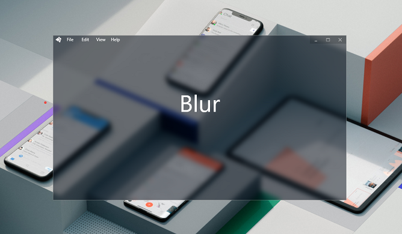
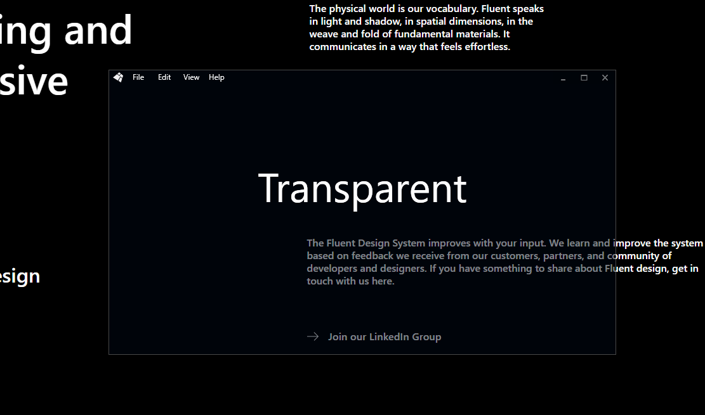

# FluentWpfChromes


## Content
* **[AcrylicChrome](#acrylicchrome)** - sets the acrylic effect for the custom WPF window according to the Flurnt Design concept. You can set an additional understratum color to shade the acrylic.
  
* **[AeroglassChrome](#aeroglasschrome)** - sets the blur effect for a custom WPF window.
* **[TransparentChrome](#transparentchrome)** - tunes native transparency.
  
## Install
*CLI  Nuget Pack command*
```
Install-Package FluentWPFChromes
```
https://nuget.org/packages/FluentWpfChromes

## Preparation
In MainWindow.xaml file, add the FluentWpfChromes namespace, set WindowStyle = none, set Background brush the necessary transparency.
```
xmlns:f="clr-namespace:FluentWpfChromes;assembly=FluentWpfChromes"
 
WindowStyle="None"
Background="#1946455F"
On this page:
```

## Usage

In the MainWindow.xaml file, add the code fragment, which is the Attached Property attribute with the corresponding chrome class AcrylicChrome, AeroGlassChrome or TransparentChrome. For the availability of other components during HitTest, it is necessary to specify the attached property IsHitTestVisibleInChrome = "True" in the componenet body tag.

# AcrylicChrome


Add the code fragment to MainWindow.xaml
```xml
<Window x:Class="AcrylicChrome_Demo.MainWindow" x:Name="AcrylicWindow"
        xmlns="http://schemas.microsoft.com/winfx/2006/xaml/presentation"
        xmlns:x="http://schemas.microsoft.com/winfx/2006/xaml"
        xmlns:d="http://schemas.microsoft.com/expression/blend/2008"
        xmlns:mc="http://schemas.openxmlformats.org/markup-compatibility/2006"
        xmlns:system="clr-namespace:System;assembly=mscorlib"
        xmlns:f="clr-namespace:FluentWpfChromes;assembly=FluentWpfChromes"
        mc:Ignorable="d"
        Height="550" Width="450"
        WindowStyle="None"
        Background="#1946455F"
        MouseDoubleClick="MainWindow_OnMouseDoubleClick"
       >
 
    <f:AcrylicChrome.AcrylicChrome>
        <f:AcrylicChrome/>
    </f:AcrylicChrome.AcrylicChrome>
 
    <Grid>
        <StackPanel Orientation="Vertical" VerticalAlignment="Center" f:AeroGlassChrome.IsHitTestVisibleInChrome="True">
 
            ...
 
        </StackPanel>
    </Grid>
</Window>
```
Add acrylic effect handler to code behined 
```cs
public partial class MainWindow : Window
{
    public MainWindow()
    {
        InitializeComponent();
    }
 
    private void MainWindow_OnMouseDoubleClick(object sender, MouseButtonEventArgs e)
    {
        if (!(sender is Window w)) return;
 
        var chrome = w.GetValue(AcrylicChrome.AcrylicChromeProperty);
        if (chrome == null) return;
 
        var blur = (bool)(w.GetValue(ChromeBase.IsBlurredProperty));
        w.SetValue(ChromeBase.IsBlurredProperty, !blur);
    }
}
```
<h4>Object</h4>

```cs
public class AсrylicChrome : ChromeBase → internal abstract class CromeBase : System.Windows.Freezable
```

#### Properties 
*ChromeBase*
|Name|Type|Category|Default|Description|
|-----|-----|-----|-----|-----|
|IsHitTestVisibleInChrome|bool|Attached Property|false|Sets availability HitTest component events into the chrome
|IsBlurred|bool|Attached|Property|true|On (off) blur effect
|ResizeBorderThickness|Thickness|DependencyProperty|Thickness(4,4,4,4)|Resizing border shift
|CaptionHeight|double|DependencyProperty|22.0|Header area height to drag
|AllowStartUpFrozen|bool|DependencyProperty|false|If false, in the case of a "frozen" state, it will create a new AcrylicChrome object, excluding "freezing". Useful for run from Style, when Freezable objects are delivered in the state IsFrosen = true.
|UnderStratumColor|Color|DependencyProperty|Argb(1, 0, 0, 0)|Additional native GBR channel understratum color
|RgbChannelProperty|Color|DependencyProperty|Argb(1, 0, 0, 0)|Additional native understratum color with RGB conversion
|DependencyOpacity|byte|DependencyProperty|0|Native opacity

*AcrylicChrome* 
|Name|Type|Category|Default|Description|
|-----|-----|-----|-----|-----|
|AcrylicChrome|AcrylicChrome|Attached property|null|AcrylicChrome itself
|DragDelay|int|Property|10|Drag delay to supress laging
|ResizeDelay|int|Property|30|Resize delay to supress laging
|SuppressLagging|bool|Property|true|On (off) suppress lagging. If false, drag and resize will do by common way - for absolete Windows versions

# AeroGlassChrome

<br />

Add the code fragment to MainWindow.xaml
```xml
<Window x:Class="eroGlassChrome_Demo.MainWindow" x:Name="AeroGlassWindow"
        xmlns="http://schemas.microsoft.com/winfx/2006/xaml/presentation"
        xmlns:x="http://schemas.microsoft.com/winfx/2006/xaml"
        xmlns:d="http://schemas.microsoft.com/expression/blend/2008"
        xmlns:mc="http://schemas.openxmlformats.org/markup-compatibility/2006"
        xmlns:f="clr-namespace:FluentWpfChromes;assembly=FluentWpfChromes"
        xmlns:system="clr-namespace:System;assembly=mscorlib"
        mc:Ignorable="d"
        Height="550" Width="450"
        WindowStyle="None"
        Background="#3346455F"
        MouseDoubleClick="MainWindow_OnMouseDoubleClick">
 
    <f:AeroGlassChrome.AeroGlassChrome>
        <f:AeroGlassChrome/>
    </f:AeroGlassChrome.AeroGlassChrome>
 
    <Grid>
        <StackPanel Orientation="Vertical" VerticalAlignment="Center" f:AeroGlassChrome.IsHitTestVisibleInChrome="True">
 
           ...
 
        </StackPanel>
    </Grid>
 
</Window>
```
Add blur effect handler to code behined 
```cs
public partial class MainWindow : Window
{
    public MainWindow()
    {
        InitializeComponent();
    }
 
    private void MainWindow_OnMouseDoubleClick(object sender, MouseButtonEventArgs e)
    {
        if (!(sender is Window w)) return;
        if (e.ChangedButton != MouseButton.Left) return;
 
        var chrome = w.GetValue(AeroGlassChrome.AeroGlassChromeProperty);
        if (chrome == null) return;
 
        var blur = (bool)(w.GetValue(ChromeBase.IsBlurredProperty));
        w.SetValue(ChromeBase.IsBlurredProperty, !blur);
 
    }
}
```xml

<h4>Object</h4>

```cs
public class AсrylicChrome : ChromeBase → internal abstract class CromeBase : System.Windows.Freezable
```
Inherirs [ChromeBase properties](#properties)

# TransparentChrome

<br />

Tunes opacity.

Add same code fragment
```xml
<f:TransparentChrome.TransparentChrome>
    <f:TransparentChrome/>
</f:TransparentChrome.TransparentChrome>
```

<h4>Object</h4>

```cs
public class AеroGlassChrome : ChromeBase → internal abstract class CromeBase : System.Windows.Freezable
```

Inherirs [ChromeBase properties](#properties)

## Resources

* [Error actylic move window issue][3] - mouse lagging GitHub discussion, 5 Apr 2019 · 32 комментария
* [Adding Acrylic Blur to your Windows 10 (Redstone 4) desktop apps][2] - Rafael Rivera article, February 1, 2018
* [Adding the "Aero Glass" blur to your Windows 10 apps][1] - Rafael Rivera article, July 8, 2015

[3]: https://github.com/File-New-Project/EarTrumpet/issues/349
[2]: https://withinrafael.com/2018/02/02/adding-acrylic-blur-to-your-windows-10-apps-redstone-4-desktop-apps/
[1]: https://withinrafael.com/2015/07/08/adding-the-aero-glass-blur-to-your-windows-10-apps/


